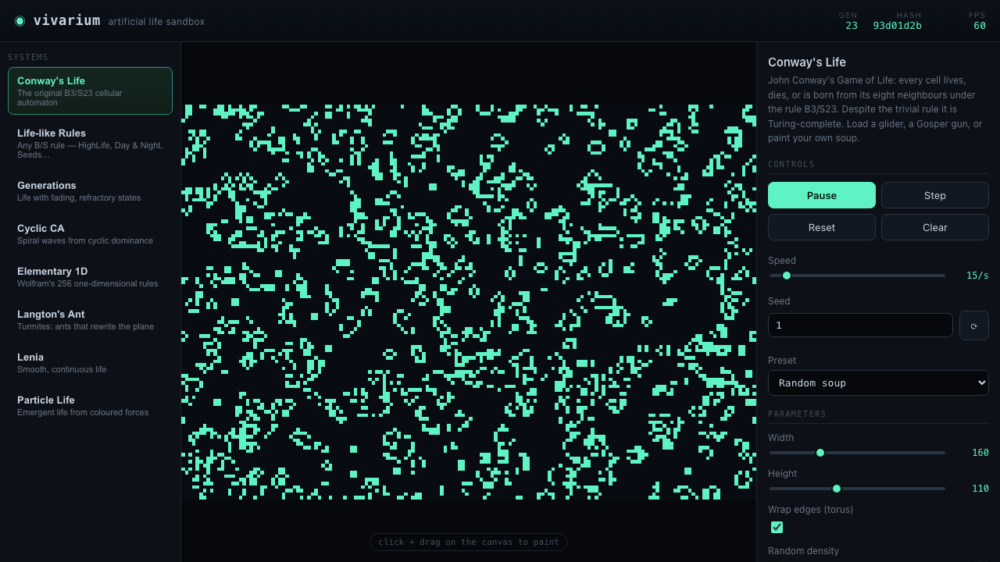
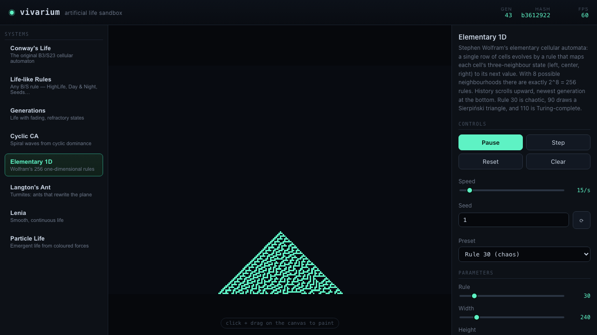
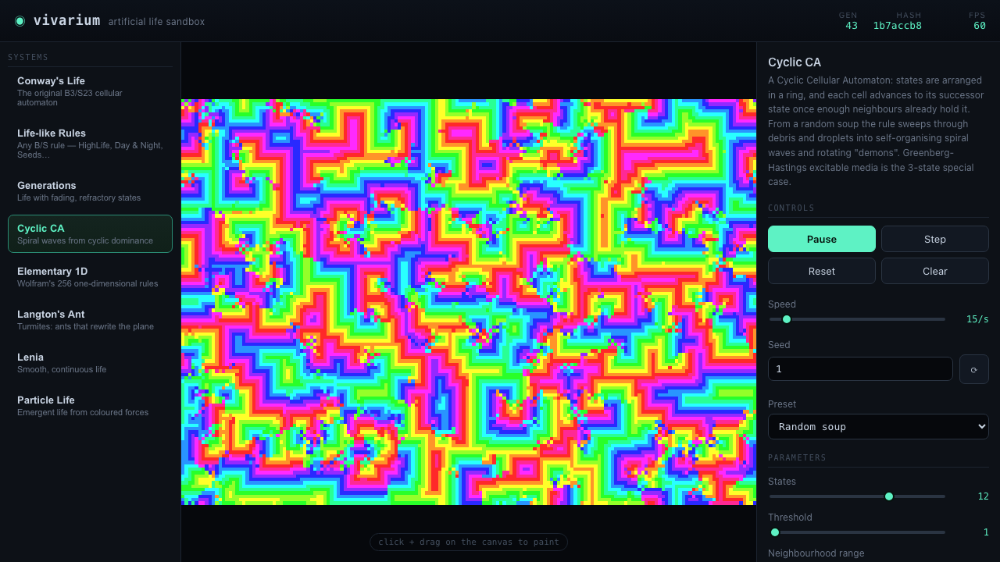
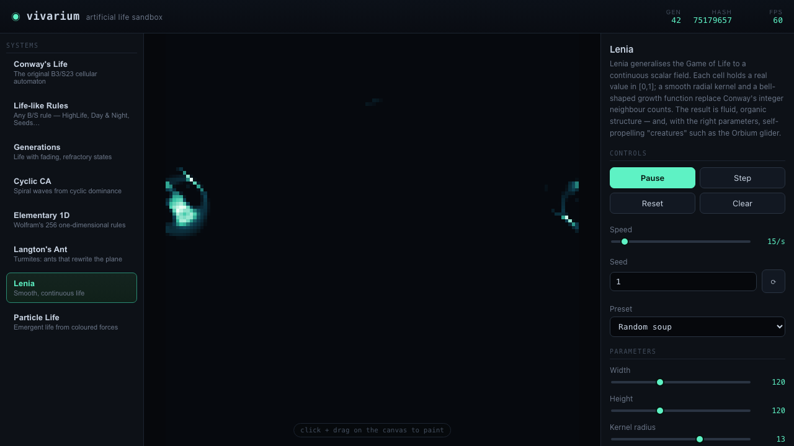
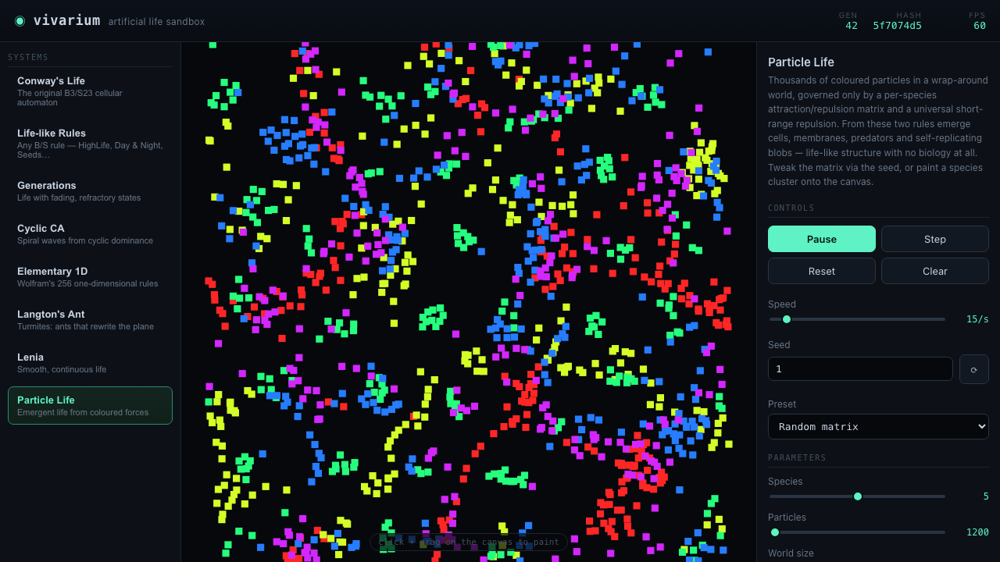

# vivarium

A client-side **artificial-life sandbox** — a gallery of deterministic
cellular-automata and life systems, each a self-contained module with a seedable
initial state and a deterministic step function. Pure TypeScript (strict) + Vite,
no backend, no GPU, no runtime dependencies. Light runtime, heavy build.



## Systems

Eight distinct systems, each with deep parameter control, presets, seeding, and
canvas painting:

| System | What it is |
| --- | --- |
| **Conway's Life** | The original `B3/S23` automaton, with a hand-verified pattern library (glider, Gosper gun, spaceships, pulsar, pentadecathlon, acorn). |
| **Life-like Rules** | Any two-state `B/S` rule, live-editable: HighLife, Day & Night, Seeds, Replicator, Maze, Coral, Anneal, Diamoeba… |
| **Generations** | Multi-state life with refractory "dying" states (`S/B/C`): Brian's Brain, Star Wars, Frogs, Bombers. |
| **Cyclic CA** | States on a cycle; cells advance when enough neighbours hold the successor state → spiral waves and "demons". |
| **Elementary 1D** | All 256 Wolfram one-dimensional rules; history scrolls upward. Rule 30, 90, 110, 184… |
| **Langton's Ant** | Agent-based turmites with `L/R/U/N` turn-string rules and multiple ants. |
| **Lenia** | Continuous CA — a smooth `[0,1]` field convolved with a radial bump kernel and a bell-shaped growth function. |
| **Particle Life** | Thousands of coloured particles driven by a per-species attraction/repulsion matrix; emergent cells and predators. |

<table>
  <tr>
    <td></td>
    <td></td>
  </tr>
  <tr>
    <td></td>
    <td></td>
  </tr>
</table>

## Architecture

Everything talks to two interfaces in [`src/core/types.ts`](src/core/types.ts):

- **`SystemDef`** — static metadata, a declarative parameter schema, presets, and
  a `create(params, seed, preset)` factory.
- **`Simulation`** — mutable state with a deterministic `step()`, a `render()`
  returning one of three render models (`cells` / `field` / `particles`), a
  `hash()` of the full state, and optional `paint()` / `clear()`.

```
src/
  core/      types (the contract), mulberry32 PRNG, FNV-1a state hash, registry
  systems/   one self-contained module per system (+ a shared Life-like engine)
  render/    canvas-2D renderer: typed arrays → ImageData, nearest-neighbour blit
  ui/        framework-free gallery, auto-generated controls, transport, painting
```

**Determinism** is enforced: all randomness flows from a seeded `mulberry32`
PRNG, never `Math.random`. The same seed + step count always produces the same
state hash — pinned per system and at the registry level in the test suite.

**Cheap rendering**: grid/field systems paint into an offscreen `ImageData` at
native cell resolution and blit it scaled with nearest-neighbour; particle
systems draw squares grouped by species. No per-frame allocation. The whole app
is ~46 kB of JS (~15 kB gzipped).

## Develop

```bash
pnpm install
pnpm dev          # Vite dev server
pnpm typecheck    # tsc --noEmit (strict)
pnpm test         # Vitest: known-outcome + determinism tests
pnpm build        # static bundle into dist/
pnpm screens      # build + Playwright screenshots into screens/
```

## Tests

Each system pins a **known outcome** (a glider returns to itself shifted by
`(1,1)` after 4 steps; Rule 30 matches its verified triangle; Langton's ant draws
a 2×2 block and returns home after 4 steps; Brian's Brain's isolated cell dies in
2; Lenia's empty field stays empty; particles stay in bounds) plus **determinism
snapshots** (seed + N steps → grid hash). 85 tests in total.

## Controls

Pick a system from the gallery, then play/pause/step, adjust speed, randomize the
seed, choose a preset, edit parameters live, and click-drag on the canvas to
paint cells (or particles). Keyboard: `space` play/pause, `s` step, `r` reset,
`n` randomize, `c` clear.

## License

[MIT](LICENSE).
